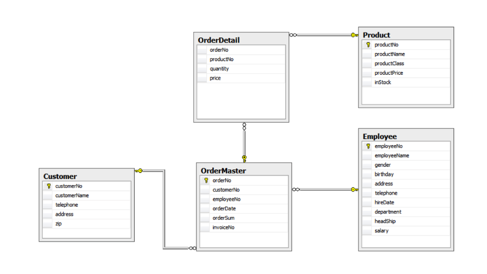

# Database Fundamentals Report

## Experiment Environment

- SQL
- Visual Studio Code
- MySQL Database

## Experiment Process

### 1.1 Stored Procedure: Query Customer Orders for a Specific Product

**Problem Description:**
The stored procedure retrieves customer ID, customer name, order ID, order quantity, and order amount for a given product name, sorted in descending order of order amount.

- **Execution Results:**
   - For the product "32M DRAM", the query returns a list of customers and their orders, sorted by order amount.

### 1.2 Stored Procedure: Query Employees Hired Before a Given Employee

**Problem Description:**
The stored procedure retrieves employee ID, name, gender, hire date, and department for employees hired before the given employee ID in the same department.

- **Execution Results:**
   - For employee "E2008005", the query returns employees hired before this individual in the same department.

### 2.1 Stored Function: Calculate Average Order Price of a Product

**Problem Description:**
The stored function returns the average order price for a given product name.

- **Execution Results:**
   - For a product like "32M DRAM", the function returns an average price based on the order quantity and total price for all orders of that product.

### 2.2 Stored Function: Calculate Total Sales Quantity of a Product

**Problem Description:**
The stored function calculates the total sales quantity for a given product ID. Products with sales greater than 4 are retrieved.

- **Execution Results:**
   - The query returns products with total sales greater than 4 units, showing the product number, name, and sales quantity.

### 3.1 Constraint: Limit Product Price

**Problem Description:**
When inserting a product, if the price exceeds 1000, it will be capped at 1000.

- **Execution Results:**
   - When attempting to insert a product with a price of 1500, the price is automatically capped at 1000, ensuring it doesn't exceed the limit.

### 3.2 Constraint: Adjust Employee Salary on Order Completion

**Problem Description:**
When an employee completes a new order, their salary increases by 5%; if hired before 1992, they receive an additional 3% increase (total 8%).

- **Execution Results:**
   - After inserting a new order into the `OrderMaster` table, the salary of the employee ("E2008005") is updated according to the defined salary adjustment rule.

### 4.1 Query: Top 20 Highest Paid Employees

**Problem Description:**
Retrieve the top 20 highest paid employees.

- **Execution Results:**
   - The query returns a list of the top 20 highest-paid employees, ordered by salary in descending order.

### 4.2 Query: Insert New Customer

**Problem Description:**
Insert a new customer into the customer table.

- **Execution Results:**
   - A new customer ("Taikang Co., Ltd.") is successfully inserted into the `Customer` table, with all the provided details.

### 4.3 Deletion: Remove High-Salary Employees

**Problem Description:**
Remove employees whose salary is greater than 5000.

- **Execution Results:**
   - Employees with salaries over 5000 are successfully deleted from the `Employee` table.

### 5. Dynamic SQL: Adjust Salary and Query Customer Information

**Problem Description:**
Increase the salary of all employees in the "Sales Department" by 200. Retrieve customer names, addresses, and phone numbers from the customer table.

- **Execution Results:**
   - The salary of all employees in the "Sales Department" is increased by 200. The customer details (names, addresses, and phone numbers) are retrieved from the `Customer` table.

## Database Structure

## Challenges Encountered and Solutions

**Challenges:**

- Handling complex joins in stored procedures.
- Ensuring data integrity while enforcing constraints.
- Performance optimization for large dataset queries.

**Solutions:**

- Used indexing strategies to improve query performance.
- Implemented triggers and constraints to maintain data integrity.
- Optimized stored procedures with efficient query design.

## References and Acknowledgments

- SQL Documentation
- Database Systems Course Materials
- Stack Overflow discussions on SQL query optimization
- Consultation with peers and instructors
